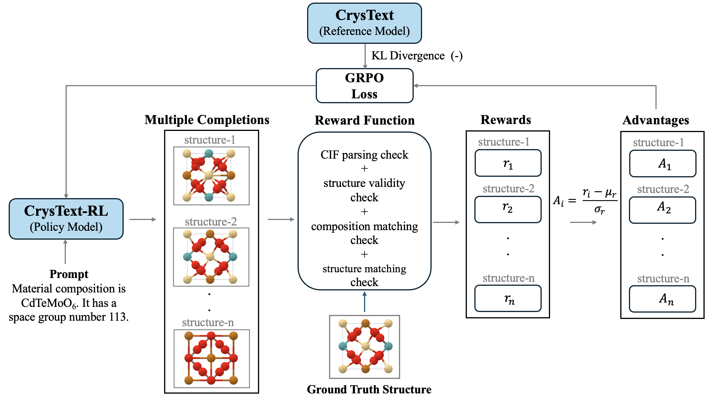

## CrysText: A Generative AI Approach for Text-Conditioned Crystal Structure Generation using LLM

<p align="center">
  <a href="https://chemrxiv.org/engage/chemrxiv/article-details/6902b85bef936fb4a21c992a" target="_blank">
    <br>
    <span style="font-size:28px; font-weight:700;">PAPER</span>
  </a>
</p>

- **CrysText** is a generative framework that creates crystal structures directly from natural-language descriptions.
- Takes prompts specifying **composition** and **space group**, and outputs valid **CIF (Crystallographic Information File)** structures. 
- CrysText is capable of generating novel crystal structures that are thermodynamically stable, guided by energy-above-hull conditioning.

---

### Methodology
- Built using **LLaMA-3.1-8B** and **Mistral-7B-v0.3**, fine-tuned with **Quantized Low-Rank Adaptation (QLoRA)**.
- Enables **efficient, scalable CIF generation** without the need for post-processing.
- Uses **energy above the convex hull** as an additional conditioning signal to promote thermodynamic stability.
- Designed to support inverse design workflows in **materials informatics**.

---


### CrysText-RL (Reinforcement Learning Extension)
- Extends CrysText using **Group Relative Policy Optimization (GRPO)**.
- Applies reinforcement learning directly on generated CIFs using **group-based normalized rewards**.
- Improves:
  - Composition and space-group satisfiability  
  - Structure match rate and validity  
  - Robustness beyond supervised fine-tuning  


---


## Crystal Structure Prediction


## Crystal Structure Generation


## CrysText-RL workflow



CrysText-RL enhances crystal structure generation using Group Relative Policy Optimization (GRPO). For each text prompt, the model generates multiple CIF samples, which are rewarded based on format validity, structural realism, composition accuracy, and similarity to the target structure. Normalized group rewards guide policy updates, while a KL term keeps the model aligned with the original CrysText baseline. This reinforcement learning loop improves composition fidelity, symmetry adherence, and structural match rate beyond supervised fine-tuning.

---

## Installation

### Prerequisites
- Python 3.11
- CUDA 12.6 compatible GPU
- Conda or Miniconda

### Setup Environment

1. **Create a new conda environment:**
```bash
conda create -n CrysText python=3.11 -y
conda activate CrysText
```

2. **Install dependencies:**
```bash
pip install --upgrade pip
pip install -r requirements.txt
```

---

## Usage

### Inference

Generate crystal structures from composition and space group:

```bash
python inference.py [model_path] [composition] [space_group] [output_cif_path]
```

**Example:**
```bash
python inference.py truptimohanty/CrysText NdAgHg2 225 output.cif
```

**Default values:**
- `model_path`: `truptimohanty/CrysText`
- `composition`: `NdAgHg2`
- `space_group`: `225`
- `output_cif_path`: `./generated_structure.cif`

### Conditioning with Energy above hull 
```bash
python conditioning_ehull.py
```


### Fine-tuning

Train the model on your own dataset:

**Arguments:**
- `--model`: Base model (default: `unsloth/mistral-7b-v0.3`)
- `--train_csv`: Path to training CSV with columns: `instruction`, `input`, `output`
- `--output_dir`: Checkpoint directory (default: `finetune_checkpoint`)
- `--adapters_dir`: LoRA adapters directory (default: `trained_lora_adapters`)
- `--max_seq_length`: Maximum sequence length (default: `2048`)
- `--lora_rank`: LoRA rank (default: `16`)
- `--num_train_epochs`: Number of epochs (default: `10`)

### GRPO Training

Train with reinforcement learning (default: uses CrysText as reference model):

```bash
python grpo_training.py
```

---

## Fine-Tuned Models

All models are available on Hugging Face:

### CrysText Models
- **[truptimohanty/CrysText](https://huggingface.co/truptimohanty/CrysText)** - Fine-tuned Mistral-7B-v0.3 model for crystal structure generation
- **[truptimohanty/CrysText-RL](https://huggingface.co/truptimohanty/CrysText-RL)** - GRPO-trained model with reinforcement learning feedback
- **[truptimohanty/CrysText_Ehull_Mistral](https://huggingface.co/truptimohanty/CrysText_Ehull_Mistral)** - Fine-tuned Mistral-7B-v0.3 conditioned on energy above convex hull
- **[truptimohanty/CrysText_Ehull_LLaMA](https://huggingface.co/truptimohanty/CrysText_Ehull_LLaMA)** - Fine-tuned LLaMA-3.1-8B conditioned on energy above convex hull

### Usage in Code
```python
# Load CrysText model
model, tokenizer = FastLanguageModel.from_pretrained(
    model_name="truptimohanty/CrysText",
    max_seq_length=2048,
    dtype=None,
    load_in_4bit=True
)

# Load CrysText-RL model
model, tokenizer = FastLanguageModel.from_pretrained(
    model_name="truptimohanty/CrysText-RL",
    max_seq_length=2048,
    dtype=None,
    load_in_4bit=True
)

# Load E_hull Mistral model
model, tokenizer = FastLanguageModel.from_pretrained(
    model_name="truptimohanty/CrysText_Ehull_Mistral",
    max_seq_length=2048,
    dtype=None,
    load_in_4bit=True
)

# Load E_hull LLaMA model
model, tokenizer = FastLanguageModel.from_pretrained(
    model_name="truptimohanty/CrysText_Ehull_LLaMA",
    max_seq_length=2048,
    dtype=None,
    load_in_4bit=True
)
```

---

## 🚀 Quick Setup Guide

```bash
# 1. Create environment
conda create -n CrysText python=3.11 -y
conda activate CrysText

# 2. Install dependencies
pip install --upgrade pip
pip install -r requirements.txt

# 3. Run inference
python inference.py

python inference.py truptimohanty/CrysText "NdAgHg2" 225 output.cif

# 4. Fine-tune (optional, default: mistral-7b-v0.3)
python finetune.py

# 5. Conditioning with E_hull
python conditioning_ehull.py

# 6. Reinforcement Learning
python grpo_training.py

```

**Usage:** 
- Inference: `python inference.py [model_path] [composition] [space_group] [output_file]`
- Conditioning: `python conditioning_ehull.py`
- Fine-tune: `python finetune.py` (uses `unsloth/mistral-7b-v0.3` by default)
- Reinforcement Learning: `python grpo_training.py` (uses CrysText as reference model)

---

